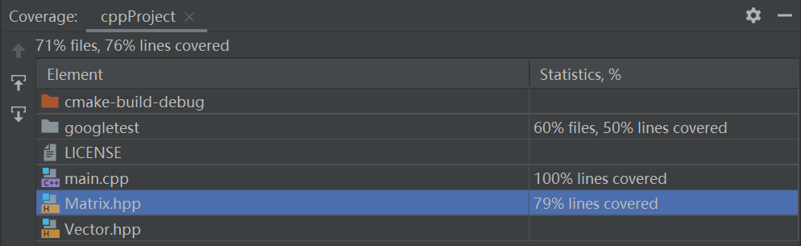
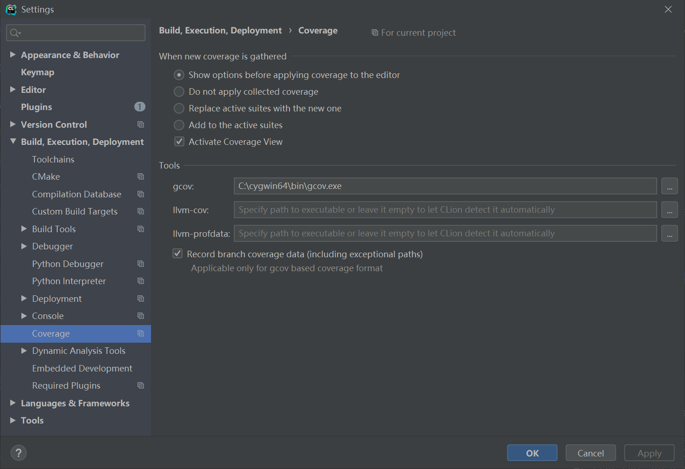

# C-project
## 短期目标：

2) 计算特征向量，计算逆和计算行列式。
4) 它应该尽可能多地处理可能出现的异常。

**已添加部分测试**

目前测试覆盖率：

覆盖率测试添加：

工具为gcov

## 已完成（矩阵部分）：

### 基本属性
`vector<vector<complex<double>>> vector` 每个元素为`std::complex<double>`的二维vector

`int row, column;` 矩阵的行，列。

`x.show();` 打印x矩阵，结果类似于python中np

`x.showSize()` 打印x矩阵的行列，用于异常提醒

`x.getRow()` 返回x矩阵的行数

`x.getColumn()`返回x矩阵的列数
### 初始化（默认每个元素为std::complex<double>，使用二维vector存储）

`vector x;` x为row=0，column=0的空矩阵。

`Matrix x = Matrix(3, 4);` x为row=3，column=4的所有项为0的矩阵

`Matrix x= Matrix(10);` x为row=1，column=10的向量。

### 设置行，列

`x.setRow(10);` 将x的row设定为10，若x原先的row小于10则扩充元素为0的矩阵，若x的row大于10，则删除掉多余的row

`x.setColumn(10);`将x的column设定为10，若x原先的column小于10则扩充元素为0的矩阵，若x的column大于10，则删除掉多余的column

### 重载[]访问矩阵元素
`x[i][j]` 访问矩阵x的第i行第j列元素。

### 重载+ - *，实现矩阵间的运算，矩阵和向量间的运算
`y=a+b;` y为矩阵a和b的和，若a和b的size不相等，则会抛出异常。

`y=a+b;` y为矩阵a和向量b的和，其中y的结果为a的每行加上b

### 基本算术操作
`x.findMax()` 返回矩阵x中实数部分最大的实数部分（由于复数无法比较大小，方法只对矩阵中所有元素的实部进行比较），如果矩阵为空矩阵则返回0

`x.findMaxAtRow(int row)` 返回矩阵x中第row行的最大的实数部分

`x.findMaxAtColumn(int column)` 返回矩阵x中第column行的最大的实数部分

`x.findMin()` 返回矩阵x中最小的实数部分

`x.findMinAtRow(int row)` 返回矩阵x第row行中最小的实数部分

`x.findMinAtColumn(int column)` 返回矩阵x中第column行中最小的实数部分

`x.findSum()`返回矩阵x中所有元素的和，返回值为复数，若x为空矩阵返回实部虚部都为0的复数。

`x.findSumAtRow(int row)` 返回矩阵x中第row行的元素和。

`x.findSumAtColumn(int column)` 返回矩阵x中第colum行的元素和。 

`x.findAverage()` 返回矩阵x中的平均值，返回值为复数，若为空矩阵则返回实部虚部都为0的复数。

`x.findAverageAtRow(int row)` 返回矩阵x中第row行的平均值。

`x.findAverageAtColumn(int column);` 返回矩阵x中第column列的平均值。

`x.transposition()` 返回x的转置

`x.transposition_change()` 返回x的转置（并且x变成自己的转置）。

`x.element_wise_multiplication(y)`返回x与y的元素乘结果

`x.element_wise_multiplication_change(y)` 返回x与y的元素乘结果,并改变x

`x.conjugation_change();` 返回x的共轭矩阵，并改变x
## 已完成（向量部分）
### 基本属性
`vector<complex<double>> vector` 每个元素为std::complex<double>的一维vector

`int length` 向量的长度。

`getLength()` 返回向量的长度。
### 初始化
`Vector x=Vector()` 生成一个长度为0的空向量

`Vector x=Vector(int length)` 生成一个长度位length的向量，所有元素为{0,0}
### 设置长度
`x.setLength(int length)` 将向量的长度设置为length，多的元素补为{0,0}，少的部分删掉元素。
### 重载[]访问向量元素
`x[i]`访问向量x的第i位元素
### 重载+ - * 进行向量和矩阵间的运算，向量和向量的运算，向量和常数间的运算
`y=a+b` 向量y为a和b的向量和

`y=a-b` 向量y为a和b的向量差
### 基本算数操作
`x.findMax()` 返回实部最大的元素的实部

`x.findMin()` 返回实部最小的元素的实部

`x.findSum()` 返回向量所有元素的和

`x.findAverage()` 返回向量所有元素的平均值

`x.dot_product(y)` 返回x与向量y的点积

`x.conjugation()` 返回x的共轭向量

`x.conjugation_change();` 返回x的共轭向量，同时改变x

`x.element_wise_multiplication()` 返回x与y的元素乘积

`x.element_wise_multiplication_change(y)` 返回x与y的元素乘积,并改变x

`x.reshape(int row,int column)` 将x变成行为row，列为column的矩阵，若元素不足补0，反之舍弃多余元素

`x.reshape_change(int row,int column)` 同上，并改变x

`x.slicing(int from,int to)` 将x的[from,to)范围内元素切片成向量或一维矩阵

`x.cal_traces()` 返回矩阵的trace（迹，对角线元素和）

## 暂时放弃的目标

### 稀疏矩阵的存储

模仿np
## 需求文档
Building a library for matrix computation

Matrix is an important concept introduced in linear algebra. Matrix calculation is widely used in many practical applications, such as image processing and machine learning. Programmers can indeed use many different existing libraries, and in certain cases, programmers are required to design their own matrix calculation libraries for specific implementations. This project will build a new library (do not attempt to directly copy codes from other existing library) that can perform the following operations on the matrix:
1) It supports all matrix sizes, from small fixed-size matrices to arbitrarily large dense matrices, and even sparse matrices (Add: try to use efficient ways to store the sparse matrices).
2) It supports all standard numeric types, including std::complex, integers, and is easily extensible to custom numeric types.
3) It supports matrix and vector arithmetic, including addition, subtraction, scalar multiplication, scalar division, transposition_change, conjugation_change, element-wise multiplication, matrix-matrix multiplication, matrix-vector multiplication, dot product and cross product.
4) It supports basic arithmetic reduction operations, including finding the maximum value, finding the minimum value, summing all items, calculating the average value (all supporting axis-specific and all items).
5) It supports computing eigenvalues and eigenvectors, calculating traces, computing inverse and computing determinant.
6) It supports the operations of reshape and slicing.
7) It supports convolutional operations of two matrices.
8) It supports to transfer the matrix from OpenCV to the matrix of this library and vice versa.
9) It should process likely exceptions as much as possible.

