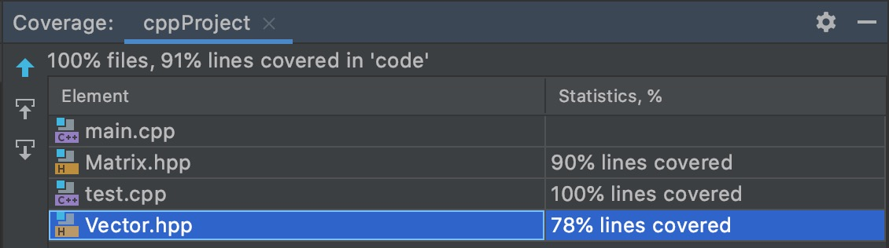

# C-project
## 说明
### windows 配置如下
`cygwin` +`opencv3.4` 
### mac 配置如下
#### 配置brew
`/bin/zsh -c "$(curl -fsSL https://gitee.com/cunkai/HomebrewCN/raw/master/Homebrew.sh)"`
#### 安装opencv
`cd "$(brew --repo)"`

`git remote set-url origin https://mirrors.tuna.tsinghua.edu.cn/git/homebrew/brew.git`

`cd "$(brew --repo)/Library/Taps/homebrew/homebrew-core"`

`git remote set-url origin https://mirrors.tuna.tsinghua.edu.cn/git/homebrew/homebrew-core.git ` 

`brew update`

`brew install opencv`
#### 安装gtest
`git clone https://github.com/google/googletest`

`cd googletest`

`mkdir build`

`cd build`

`cmake .. -DCMAKE_CXX_STANDARD=17`

`make`

`make install`

目前测试覆盖率：

覆盖率测试添加：

工具为gcov

## 需求文档
Building a library for matrix computation

Matrix is an important concept introduced in linear algebra. Matrix calculation is widely used in many practical applications, such as image processing and machine learning. Programmers can indeed use many different existing libraries, and in certain cases, programmers are required to design their own matrix calculation libraries for specific implementations. This project will build a new library (do not attempt to directly copy codes from other existing library) that can perform the following operations on the matrix:
1) It supports all matrix sizes, from small fixed-size matrices to arbitrarily large dense matrices, and even sparse matrices (Add: try to use efficient ways to store the sparse matrices).
2) It supports all standard numeric types, including std::complex, integers, and is easily extensible to custom numeric types.
3) It supports matrix and vector arithmetic, including addition, subtraction, scalar multiplication, scalar division, transposition_change, conjugation_change, element-wise multiplication, matrix-matrix multiplication, matrix-vector multiplication, dot product and cross product.
4) It supports basic arithmetic reduction operations, including finding the maximum value, finding the minimum value, summing all items, calculating the average value (all supporting axis-specific and all items).
5) It supports computing eigenvalues and eigenvectors, calculating traces, computing inverse and computing determinant.
6) It supports the operations of reshape and slicing.
7) It supports convolutional operations of two matrices.
8) It supports to transfer the matrix from OpenCV to the matrix of this library and vice versa.
9) It should process likely exceptions as much as possible.

